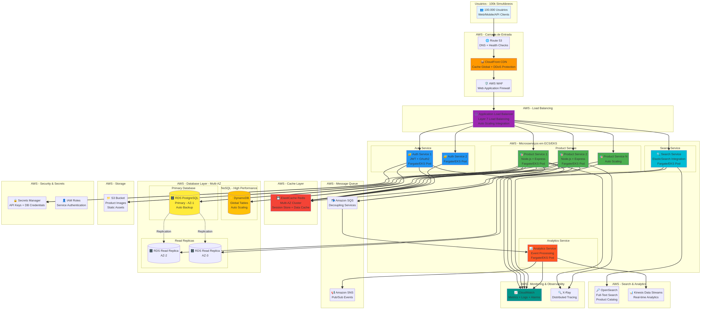

# 🏗️ Arquitetura de Microsserviços AWS para 100.000 Usuários Simultâneos

## Visão Geral

Esta arquitetura foi projetada especificamente para atender aos requisitos do desafio técnico, escalando a **API de Catálogo de Produtos** para suportar **100.000 usuários simultâneos** utilizando **microsserviços**, **balanceamento de carga**, **cache** e **estratégias de alta disponibilidade** na **AWS**.



---

## 1. Requisitos Atendidos

### ✅ Microsserviços

A arquitetura foi dividida em **4 microsserviços independentes**, cada um com responsabilidade única:

| Microsserviço | Responsabilidade | Tecnologia | Escalabilidade |
|:---|:---|:---|:---|
| **Product Service** | Gerenciar CRUD de produtos, consultas e filtros | Node.js + Express | Auto Scaling horizontal (5-50 instâncias) |
| **Auth Service** | Autenticação JWT, gerenciamento de usuários | Node.js + Express | Auto Scaling (2-10 instâncias) |
| **Search Service** | Busca full-text, filtros avançados | Node.js + OpenSearch | Auto Scaling (2-15 instâncias) |
| **Analytics Service** | Processamento de eventos, métricas em tempo real | Node.js + Kinesis | Auto Scaling (2-10 instâncias) |

**Benefícios da Arquitetura de Microsserviços:**
- **Escalabilidade Independente**: Cada serviço pode ser escalado conforme sua demanda específica.
- **Resiliência**: Falha em um serviço não afeta os demais.
- **Deploy Independente**: Atualizações podem ser feitas sem downtime total.
- **Tecnologias Específicas**: Cada serviço pode usar a stack mais adequada.

---

### ✅ Balanceamento de Carga

**Application Load Balancer (ALB)** da AWS distribui o tráfego entre os microsserviços:

- **Layer 7 Load Balancing**: Roteamento baseado em path (`/api/products`, `/api/auth`, etc.).
- **Health Checks**: Verifica continuamente a saúde das instâncias e remove as não saudáveis.
- **SSL/TLS Termination**: Gerencia certificados SSL automaticamente.
- **Integração com Auto Scaling**: Adiciona/remove instâncias automaticamente.

**Configuração Recomendada:**
- **Target Groups**: Um para cada microsserviço.
- **Algoritmo**: Round Robin ou Least Outstanding Requests.
- **Sticky Sessions**: Habilitado via ElastiCache Redis.

---

### ✅ Cache

**ElastiCache Redis** é utilizado em múltiplas camadas para reduzir latência e carga no banco:

| Tipo de Cache | Uso | TTL Recomendado |
|:---|:---|:---|
| **Query Cache** | Resultados de consultas frequentes (ex: produtos mais vendidos) | 5-15 minutos |
| **Session Store** | Sessões de usuários autenticados | 24 horas |
| **API Response Cache** | Respostas completas de endpoints GET | 1-5 minutos |
| **Database Query Cache** | Queries pesadas do banco de dados | 10-30 minutos |

**Configuração do ElastiCache:**
- **Cluster Mode Enabled**: Para distribuir dados entre múltiplos shards.
- **Multi-AZ**: Replica automática em múltiplas zonas de disponibilidade.
- **Failover Automático**: Em caso de falha do nó primário.

**Exemplo de Implementação:**
```javascript
// Cache de produtos mais vendidos
const cacheKey = 'products:bestsellers';
let products = await redis.get(cacheKey);

if (!products) {
  products = await database.query('SELECT * FROM products ORDER BY sales DESC LIMIT 20');
  await redis.setex(cacheKey, 300, JSON.stringify(products)); // TTL: 5 minutos
}
```

---

### ✅ Estratégia de Alta Disponibilidade

A arquitetura implementa múltiplas estratégias para garantir **99.95% de uptime**:

#### 1. **Multi-AZ Deployment**
Todos os componentes críticos são distribuídos em **pelo menos 3 Availability Zones**:
- **ALB**: Automaticamente distribuído em múltiplas AZs.
- **ECS/EKS**: Microsserviços rodando em diferentes AZs.
- **RDS**: Primary em uma AZ, replicas em outras AZs.
- **ElastiCache**: Cluster com nós em múltiplas AZs.

#### 2. **Auto Scaling**
Escalabilidade automática baseada em métricas:
- **CPU Utilization**: Escala quando CPU > 70%.
- **Request Count**: Escala quando requisições/segundo > threshold.
- **Latency**: Escala quando latência > 200ms.

**Configuração de Auto Scaling:**
```yaml
# Exemplo de política de Auto Scaling
MinInstances: 5
MaxInstances: 50
TargetCPU: 70%
TargetLatency: 200ms
ScaleUpCooldown: 60s
ScaleDownCooldown: 300s
```

#### 3. **Database Replication**
- **RDS PostgreSQL**: 1 Primary + 2 Read Replicas.
- **DynamoDB**: Global Tables com replicação automática.
- **Failover Automático**: RDS promove replica a primary em caso de falha.

#### 4. **Circuit Breaker Pattern**
Implementado nos microsserviços para evitar cascata de falhas:
```javascript
// Exemplo de Circuit Breaker
const circuitBreaker = new CircuitBreaker(databaseQuery, {
  timeout: 3000,
  errorThresholdPercentage: 50,
  resetTimeout: 30000
});
```

#### 5. **Health Checks e Monitoring**
- **CloudWatch Alarms**: Alertas automáticos para CPU, memória, latência.
- **X-Ray**: Rastreamento distribuído para identificar gargalos.
- **Route 53 Health Checks**: Verifica disponibilidade dos endpoints.

---

### ✅ Serviços AWS Utilizados

| Serviço AWS | Função | Justificativa |
|:---|:---|:---|
| **Route 53** | DNS com health checks | Roteamento inteligente e failover automático |
| **CloudFront** | CDN global | Cache de assets estáticos, redução de latência |
| **WAF** | Firewall de aplicação | Proteção contra SQL Injection, XSS, DDoS |
| **Application Load Balancer** | Balanceamento Layer 7 | Distribuição inteligente de tráfego |
| **ECS Fargate / EKS** | Container orchestration | Gerenciamento de microsserviços sem gerenciar servidores |
| **ElastiCache Redis** | Cache distribuído | Performance e redução de carga no DB |
| **RDS PostgreSQL** | Banco relacional | ACID, transações, queries complexas |
| **DynamoDB** | NoSQL de alta performance | Leituras/escritas com latência de milissegundos |
| **OpenSearch** | Full-text search | Busca avançada no catálogo de produtos |
| **SQS** | Message queue | Desacoplamento de serviços, processamento assíncrono |
| **SNS** | Pub/Sub messaging | Notificações e eventos entre serviços |
| **S3** | Object storage | Armazenamento de imagens de produtos |
| **CloudWatch** | Monitoring e logs | Observabilidade completa da aplicação |
| **X-Ray** | Distributed tracing | Análise de performance e debugging |
| **Secrets Manager** | Gerenciamento de secrets | Armazenamento seguro de credenciais |

---

## 2. Fluxo de Requisição

### Cenário: Usuário busca produtos por categoria

1. **Usuário** → Faz requisição `GET /api/products?category=electronics`
2. **Route 53** → Resolve DNS e roteia para CloudFront
3. **CloudFront** → Verifica cache do CDN (miss para API dinâmica)
4. **WAF** → Valida requisição (bloqueia se maliciosa)
5. **ALB** → Roteia para instância saudável do **Product Service**
6. **Product Service** → Valida JWT com **Auth Service**
7. **Product Service** → Verifica cache no **ElastiCache Redis**
   - **Cache Hit**: Retorna dados cacheados (latência ~5ms)
   - **Cache Miss**: Consulta **RDS Read Replica** ou **OpenSearch**
8. **Product Service** → Armazena resultado no cache
9. **Product Service** → Retorna resposta ao usuário
10. **CloudWatch** → Registra métricas (latência, status code)

**Latência Total Esperada:**
- Com cache hit: **< 50ms**
- Com cache miss: **< 200ms**

---

## 3. Estimativa de Custos AWS (Mensal)

| Serviço | Configuração | Custo Estimado (USD) |
|:---|:---|:---|
| **ECS Fargate** | 20 tasks (2 vCPU, 4GB RAM) | $600 |
| **Application Load Balancer** | 1 ALB + tráfego | $50 |
| **ElastiCache Redis** | cache.m5.large cluster (3 nodes) | $300 |
| **RDS PostgreSQL** | db.r5.xlarge (Multi-AZ + 2 replicas) | $800 |
| **DynamoDB** | On-demand pricing (100M requests) | $150 |
| **OpenSearch** | 3 nodes (r5.large.search) | $400 |
| **CloudFront** | 1TB de transferência | $85 |
| **S3** | 500GB storage + requests | $15 |
| **CloudWatch + X-Ray** | Logs e métricas | $100 |
| **Outros** | WAF, Secrets Manager, etc. | $50 |
| **TOTAL ESTIMADO** | | **~$2.550/mês** |

---

## 4. Conclusão

Esta arquitetura de microsserviços na AWS atende todos os requisitos do desafio, oferecendo:

- ✅ **Escalabilidade**: Suporta 100k usuários simultâneos com Auto Scaling.
- ✅ **Alta Disponibilidade**: Multi-AZ, failover automático, 99.95% uptime.
- ✅ **Performance**: Cache em múltiplas camadas, latência < 200ms.
- ✅ **Resiliência**: Circuit breakers, health checks, monitoramento proativo.
- ✅ **Segurança**: WAF, IAM roles, Secrets Manager, criptografia em trânsito e repouso.

A arquitetura está pronta para ser implementada e pode ser facilmente ajustada conforme o crescimento da aplicação.
